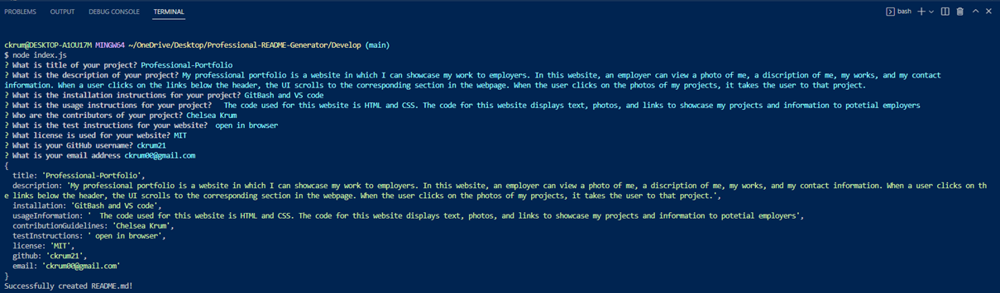
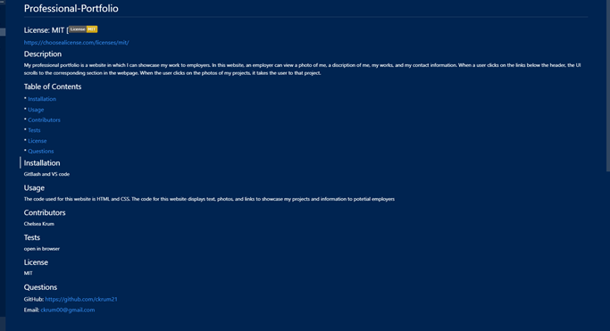

# Professional-README-Generator

## Descrpition 
This command-line application accepts input from the user about their website and turns the information into a professional README page. In the command-line, the user will enter "node index.js" and a set of questions will appear. These questions are the title, description, table of contents, installation instructions, usgae instructions, license, contributors, test, and questions. Once the infomation is entered, a new file will be made with the information printed into a README format. 

## Installation
link to website: https://ckrum21.github.io/Professional-README-Generator/
link to GitHub: https://github.com/ckrum21 

Install this website by cloning the code to your local devices.

software required to download this website:
* GitBash or other terminal
* Visual Studio Code

## Usage

The language used for this application is JavaScript, node, and Inquirer. The command-line application prints a JS file when the questions are answered

## Credits
Chelsea Krum 